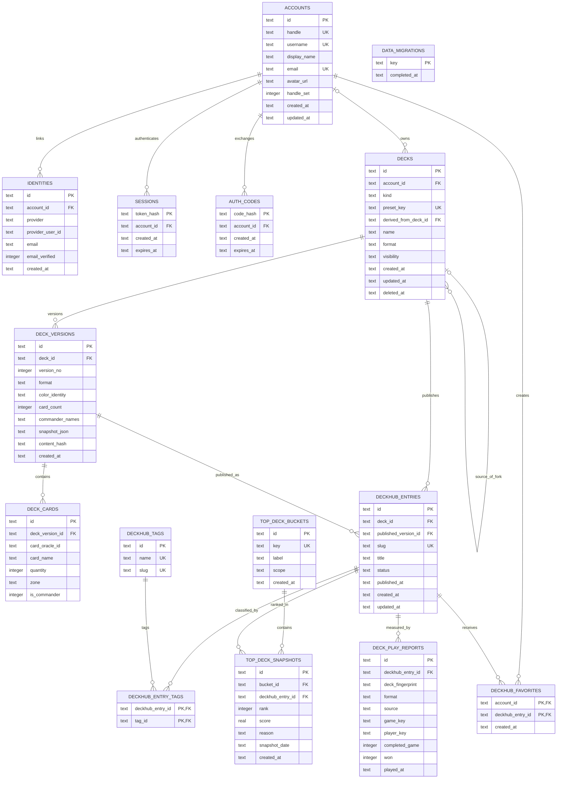

# ManaBrew Hub data model

This document describes the SQLite data model used by `manabrew-hub` for accounts, account-owned decks, immutable deck versions, Community publications, presets, favorites, and Top Deck rankings.

The executable source of truth is the ordered migration set in [`manabrew-rs/crates/manabrew-hub/migrations`](../manabrew-rs/crates/manabrew-hub/migrations). The SQL below shows the effective schema after all current migrations have run; it is documentation, not a replacement migration.

## Model at a glance

- An `account` owns user decks and can favorite Community publications.
- A `deck` is the canonical editable resource. User decks have an owner; shipped presets are ownerless canonical decks.
- A `deck_version` is an immutable content snapshot. Its normalized `deck_cards` rows support discovery and filtering, while `snapshot_json` preserves the complete playable deck.
- A `deckhub_entry` is a public Community publication tied to exactly one deck and one version of that same deck.
- Tags and favorites are many-to-many relations implemented by junction tables.
- A Top Deck bucket contains dated ranked publication rows. Rankings never point directly at mutable decks.
- Authentication identities and sessions belong to accounts but remain separate from deck ownership.

`DeckHub` is the internal API and database name. The user-facing product calls this surface **Community**.

## Entity relationship diagram



The `DECKS.account_id` relationship is optional only because preset decks are intentionally ownerless. A user deck must have an account. `DECKS.derived_from_deck_id` is a self-reference used to preserve the provenance of an account copy made from a preset.

## Effective SQLite schema

```sql
PRAGMA foreign_keys = ON;

CREATE TABLE schema_version (
    id      INTEGER PRIMARY KEY CHECK (id = 1),
    version INTEGER NOT NULL
);

CREATE TABLE accounts (
    id           TEXT PRIMARY KEY,
    handle       TEXT NOT NULL UNIQUE COLLATE NOCASE,
    handle_set   INTEGER NOT NULL DEFAULT 0,
    created_at   TEXT NOT NULL,
    username     TEXT,
    display_name TEXT,
    email        TEXT,
    avatar_url   TEXT,
    updated_at   TEXT
);

CREATE UNIQUE INDEX idx_accounts_username
    ON accounts(username COLLATE NOCASE);
CREATE UNIQUE INDEX idx_accounts_email
    ON accounts(email COLLATE NOCASE) WHERE email IS NOT NULL;

CREATE TABLE identities (
    id               TEXT PRIMARY KEY,
    account_id       TEXT NOT NULL REFERENCES accounts(id) ON DELETE CASCADE,
    provider         TEXT NOT NULL,
    provider_user_id TEXT NOT NULL,
    email            TEXT,
    email_verified   INTEGER NOT NULL DEFAULT 0,
    created_at       TEXT NOT NULL,
    UNIQUE(provider, provider_user_id)
);

CREATE INDEX idx_identities_account ON identities(account_id);
CREATE INDEX idx_identities_email
    ON identities(email COLLATE NOCASE) WHERE email_verified = 1;

CREATE TABLE sessions (
    token_hash TEXT PRIMARY KEY,
    account_id TEXT NOT NULL REFERENCES accounts(id) ON DELETE CASCADE,
    created_at TEXT NOT NULL,
    expires_at TEXT NOT NULL
);

CREATE INDEX idx_sessions_account ON sessions(account_id);

CREATE TABLE login_tokens (
    code_hash  TEXT PRIMARY KEY,
    email      TEXT NOT NULL,
    attempts   INTEGER NOT NULL DEFAULT 0,
    created_at TEXT NOT NULL,
    expires_at TEXT NOT NULL,
    request_ip TEXT NOT NULL
);

CREATE INDEX idx_login_tokens_email
    ON login_tokens(email COLLATE NOCASE, created_at);

CREATE TABLE oauth_states (
    state_hash      TEXT PRIMARY KEY,
    provider        TEXT NOT NULL,
    mode            TEXT NOT NULL,
    client          TEXT NOT NULL,
    link_account_id TEXT,
    return_to       TEXT NOT NULL,
    created_at      TEXT NOT NULL,
    expires_at      TEXT NOT NULL
);

CREATE TABLE auth_codes (
    code_hash  TEXT PRIMARY KEY,
    account_id TEXT NOT NULL REFERENCES accounts(id) ON DELETE CASCADE,
    created_at TEXT NOT NULL,
    expires_at TEXT NOT NULL
);

CREATE TABLE decks (
    id                   TEXT PRIMARY KEY,
    account_id           TEXT REFERENCES accounts(id) ON DELETE RESTRICT,
    kind                 TEXT NOT NULL DEFAULT 'user'
        CHECK (kind IN ('user', 'preset')),
    preset_key           TEXT,
    derived_from_deck_id TEXT REFERENCES decks(id) ON DELETE SET NULL,
    name                 TEXT NOT NULL,
    format               TEXT,
    description          TEXT,
    visibility           TEXT NOT NULL DEFAULT 'private'
        CHECK (visibility IN ('private', 'unlisted', 'public')),
    created_at           TEXT NOT NULL,
    updated_at           TEXT NOT NULL,
    deleted_at           TEXT,
    CHECK (
        (kind = 'user' AND account_id IS NOT NULL AND preset_key IS NULL)
        OR (kind = 'preset' AND account_id IS NULL AND preset_key IS NOT NULL)
    ),
    CHECK (kind = 'user' OR derived_from_deck_id IS NULL)
);

CREATE INDEX idx_decks_account_updated
    ON decks(account_id, deleted_at, updated_at DESC);
CREATE UNIQUE INDEX idx_decks_preset_key
    ON decks(preset_key) WHERE kind = 'preset';
CREATE UNIQUE INDEX idx_decks_account_preset_fork
    ON decks(account_id, derived_from_deck_id)
    WHERE derived_from_deck_id IS NOT NULL AND deleted_at IS NULL;

CREATE TABLE deck_versions (
    id              TEXT PRIMARY KEY,
    deck_id         TEXT NOT NULL REFERENCES decks(id) ON DELETE CASCADE,
    version_no      INTEGER NOT NULL CHECK (version_no > 0),
    notes           TEXT,
    snapshot_json   TEXT NOT NULL,
    content_hash    TEXT NOT NULL,
    created_at      TEXT NOT NULL,
    format          TEXT,
    color_identity  TEXT NOT NULL DEFAULT 'C',
    card_count      INTEGER NOT NULL DEFAULT 0 CHECK (card_count >= 0),
    commander_names TEXT NOT NULL DEFAULT '[]',
    UNIQUE(deck_id, version_no),
    UNIQUE(deck_id, id)
);

CREATE INDEX idx_deck_versions_deck_created
    ON deck_versions(deck_id, version_no DESC);
CREATE INDEX idx_deck_versions_discovery
    ON deck_versions(format, color_identity, card_count);

CREATE TABLE deck_cards (
    id               TEXT PRIMARY KEY,
    deck_version_id  TEXT NOT NULL REFERENCES deck_versions(id) ON DELETE CASCADE,
    card_oracle_id   TEXT,
    card_name        TEXT NOT NULL,
    set_code         TEXT,
    collector_number TEXT,
    foil             INTEGER NOT NULL DEFAULT 0 CHECK (foil IN (0, 1)),
    quantity         INTEGER NOT NULL CHECK (quantity > 0),
    zone             TEXT NOT NULL CHECK (
        zone IN (
            'main', 'sideboard', 'commander', 'companion', 'maybeboard',
            'attraction', 'contraption', 'scheme', 'plane', 'token'
        )
    ),
    is_commander     INTEGER NOT NULL DEFAULT 0 CHECK (is_commander IN (0, 1))
);

CREATE INDEX idx_deck_cards_version_zone
    ON deck_cards(deck_version_id, zone);
CREATE INDEX idx_deck_cards_oracle
    ON deck_cards(card_oracle_id) WHERE card_oracle_id IS NOT NULL;
CREATE INDEX idx_deck_cards_version_name
    ON deck_cards(deck_version_id, card_name COLLATE NOCASE);
CREATE INDEX idx_deck_cards_commanders
    ON deck_cards(deck_version_id, is_commander, card_name COLLATE NOCASE);

CREATE TABLE deckhub_entries (
    id                           TEXT PRIMARY KEY,
    deck_id                      TEXT NOT NULL,
    published_version_id         TEXT NOT NULL,
    slug                         TEXT NOT NULL UNIQUE COLLATE NOCASE,
    title                        TEXT NOT NULL,
    summary                      TEXT,
    cover_card_id                TEXT,
    cover_card_name              TEXT,
    status                       TEXT NOT NULL DEFAULT 'published'
        CHECK (status IN ('draft', 'published', 'unlisted', 'archived')),
    published_at                 TEXT,
    created_at                   TEXT NOT NULL,
    updated_at                   TEXT NOT NULL,
    publish_ip                   TEXT,
    FOREIGN KEY (deck_id) REFERENCES decks(id) ON DELETE RESTRICT,
    FOREIGN KEY (deck_id, published_version_id)
        REFERENCES deck_versions(deck_id, id) ON DELETE RESTRICT,
    CHECK (
        (status = 'published' AND published_at IS NOT NULL)
        OR status != 'published'
    )
);

CREATE INDEX idx_deckhub_entries_browse
    ON deckhub_entries(status, published_at DESC);
CREATE INDEX idx_deckhub_entries_deck
    ON deckhub_entries(deck_id, created_at DESC);
CREATE INDEX idx_deckhub_entries_version
    ON deckhub_entries(published_version_id);
CREATE INDEX idx_deckhub_entries_ip_day
    ON deckhub_entries(publish_ip, created_at);

CREATE TABLE deckhub_tags (
    id   TEXT PRIMARY KEY,
    name TEXT NOT NULL UNIQUE COLLATE NOCASE,
    slug TEXT NOT NULL UNIQUE COLLATE NOCASE
);

CREATE TABLE deckhub_entry_tags (
    deckhub_entry_id TEXT NOT NULL
        REFERENCES deckhub_entries(id) ON DELETE CASCADE,
    tag_id TEXT NOT NULL
        REFERENCES deckhub_tags(id) ON DELETE CASCADE,
    PRIMARY KEY (deckhub_entry_id, tag_id)
);

CREATE INDEX idx_deckhub_entry_tags_tag
    ON deckhub_entry_tags(tag_id, deckhub_entry_id);

CREATE TABLE deckhub_favorites (
    account_id       TEXT NOT NULL REFERENCES accounts(id) ON DELETE CASCADE,
    deckhub_entry_id TEXT NOT NULL REFERENCES deckhub_entries(id) ON DELETE CASCADE,
    created_at       TEXT NOT NULL,
    PRIMARY KEY (account_id, deckhub_entry_id)
);

CREATE INDEX idx_deckhub_favorites_entry
    ON deckhub_favorites(deckhub_entry_id, created_at DESC);

CREATE TABLE data_migrations (
    key          TEXT PRIMARY KEY,
    completed_at TEXT NOT NULL
);

CREATE TABLE deck_play_reports (
    id               TEXT PRIMARY KEY,
    deckhub_entry_id TEXT NOT NULL
        REFERENCES deckhub_entries(id) ON DELETE CASCADE,
    deck_fingerprint TEXT NOT NULL,
    format           TEXT,
    source           TEXT NOT NULL CHECK (source IN ('offline', 'relay')),
    game_key         TEXT,
    player_key       TEXT,
    completed_game   INTEGER NOT NULL DEFAULT 0 CHECK (completed_game IN (0, 1)),
    won              INTEGER NOT NULL DEFAULT 0 CHECK (won IN (0, 1)),
    played_at        TEXT NOT NULL
);

CREATE INDEX idx_deck_play_reports_ranking
    ON deck_play_reports(played_at, format, deckhub_entry_id, deck_fingerprint,
                         completed_game, won);
CREATE INDEX idx_deck_play_reports_game
    ON deck_play_reports(game_key) WHERE game_key IS NOT NULL;
CREATE UNIQUE INDEX idx_deck_play_reports_relay_player
    ON deck_play_reports(game_key, player_key) WHERE source = 'relay';

CREATE TABLE top_deck_buckets (
    id         TEXT PRIMARY KEY,
    key        TEXT NOT NULL UNIQUE COLLATE NOCASE,
    label      TEXT NOT NULL,
    scope      TEXT NOT NULL,
    created_at TEXT NOT NULL
);

CREATE TABLE top_deck_snapshots (
    id               TEXT PRIMARY KEY,
    bucket_id        TEXT NOT NULL
        REFERENCES top_deck_buckets(id) ON DELETE CASCADE,
    deckhub_entry_id TEXT NOT NULL
        REFERENCES deckhub_entries(id) ON DELETE RESTRICT,
    rank             INTEGER NOT NULL CHECK (rank > 0),
    score            REAL,
    reason           TEXT,
    snapshot_date    TEXT NOT NULL,
    created_at       TEXT NOT NULL,
    UNIQUE(bucket_id, snapshot_date, rank),
    UNIQUE(bucket_id, snapshot_date, deckhub_entry_id)
);

CREATE INDEX idx_top_deck_snapshots_latest
    ON top_deck_snapshots(bucket_id, snapshot_date DESC, rank ASC);

INSERT INTO top_deck_buckets (id, key, label, scope, created_at) VALUES
    ('top-decks-trending', 'trending', 'Most Played', 'all',
     '1970-01-01T00:00:00Z'),
    ('top-decks-commander', 'commander', 'Popular Commander', 'commander',
     '1970-01-01T00:00:00Z'),
    ('top-decks-staff-picks', 'staff-picks', 'Staff Picks', 'editorial',
     '1970-01-01T00:00:00Z');
```

## How the main workflows work

### Account and authentication

An account is the ownership root. OAuth providers and verified email identities are stored in `identities`; active bearer sessions are represented by hashed tokens in `sessions`. Login tokens, OAuth states, and short-lived auth codes support the authentication exchange without mixing provider-specific data into deck ownership.

Deleting an account cascades its identities, sessions, auth codes, and favorites. It does not silently delete owned decks because `decks.account_id` uses `ON DELETE RESTRICT`.

### Creating and editing a deck

Creating a deck writes:

1. One canonical row in `decks`.
2. Version `1` in `deck_versions`.
3. The version's normalized card rows in `deck_cards`.

Later saves create another version when the content hash changes. A publication therefore continues to point at the exact cards that were public when it was created, even if the owner later edits the canonical deck.

`snapshot_json` is the lossless playable representation. The normalized discovery columns and `deck_cards` rows make format, color, commander, and card-name filtering efficient without repeatedly decoding every JSON snapshot.

### Publishing to Community

Publishing creates a `deckhub_entries` row with both `deck_id` and `published_version_id`. The composite foreign key guarantees that the chosen version belongs to the chosen deck. Public metadata such as title, summary, slug, cover, tags, and status belongs to the publication rather than the editable deck.

One canonical deck may have multiple publications, and multiple publications may reference the same immutable version. Removing a publication changes its status instead of rewriting its source deck or version.

### Preset decks and account copies

Shipped presets use the same normalized deck, version, card, and publication tables as user-created content:

- Their `decks.kind` is `preset`.
- They have a unique `preset_key` and no owning account.
- Synchronization creates a new version only when preset content changes.
- The active preset version has an official Community publication.

When a signed-in player first uses a preset, ManaBrew creates one account-owned `user` deck with `derived_from_deck_id` pointing at the preset. The partial unique index makes this fork idempotent per account while it remains active. After creation the copy is a normal editable deck; changing it does not mutate the shipped preset.

### Tags and favorites

`deckhub_entry_tags` and `deckhub_favorites` are composite-primary-key junction tables. Their keys prevent duplicate tags and duplicate favorites without application-side deduplication. Deleting a publication removes its junction rows through cascading foreign keys.

### Top Deck rankings

Top Decks ranks Community publications, never anonymous statistics or mutable deck rows. Each row records:

- the bucket and snapshot date;
- the publication being ranked;
- its unique rank within that dated bucket;
- an optional numeric score;
- the user-facing reason explaining the ranking.

The measured `Most Played` and `Popular Commander` buckets are refreshed from the previous 30 days of `deck_play_reports`. Only human play with both a publication ID and matching deck fingerprint is accepted. Offline and hosted-AI clients write through `/api/deckhub/plays`; the managed relay writes authenticated game starts and outcomes through `/internal/deckhub/relay-games`. Hosted Relay rooms are excluded from the dedicated channel so the client report is not counted twice, and bot seats never contribute. This Deck Play evidence channel is separate from relay analytics. The Hub verifies every fingerprint against the immutable published version before storing it. Relay game and player identifiers are hashed before persistence, and no username or card list is stored. The reason includes the total play count and adds relay win rate after at least 20 completed matches.

Migration 7 creates the evidence table, and migration 8 completes the authoritative schema with relay-source and outcome fields plus data-migration tracking. On the first Hub startup after migration 8, the `analytics-deck-plays-v1` data migration imports every eligible historical publication-linked play from `events.db`, records completion in `data_migrations`, and never opens analytics for rankings again. Subsequent ranking refreshes read `deck_play_reports` and write `top_deck_snapshots` within `hub.db`.

The staging deployment runs `ops/staging-migrations/001_top_deck_filler.sql` once after Hub initialization. It adds current-dated synthetic evidence for five preset publications, records its own key in `data_migrations`, and is neither mounted nor executed by production Compose.

`Staff Picks` uses the same snapshot structure but has an editorial scope. New snapshot writes require a non-empty reason, so every Top Deck card can explain why it appears and can open the exact ranked card list.

The relay analytics database remains separate and is used by observability after the one-time import. Its event tables and ingestion path are documented in [OBSERVABILITY.md](OBSERVABILITY.md#sqlite-analytics-db).

## Migration path

Existing installations are upgraded transactionally. Migration 2 imports publications from the original denormalized layout into decks, versions, cards, and Community entries; migration 6 then removes that obsolete table and its compatibility columns. Migrations 7 and 8 add play evidence without rewriting an already-applied migration. Fresh databases run through the same ordered sequence and expose only the normalized schema shown above.

## SQLite conventions and invariants

- Foreign-key enforcement must be enabled on every connection with `PRAGMA foreign_keys = ON`.
- Timestamps and snapshot dates are ISO-8601 `TEXT` values.
- Boolean values use constrained SQLite integers where appropriate.
- Deck versions are treated as immutable content boundaries.
- A published Community entry must have `published_at` and must reference a version belonging to its deck.
- User decks require an owner; preset decks require a preset key and cannot have an owner.
- The same account can have at most one active fork of a given preset.
- Top Deck ranks and publications are unique within each bucket and snapshot date.
- Schema changes belong in a new numbered migration; never edit an already deployed migration.
