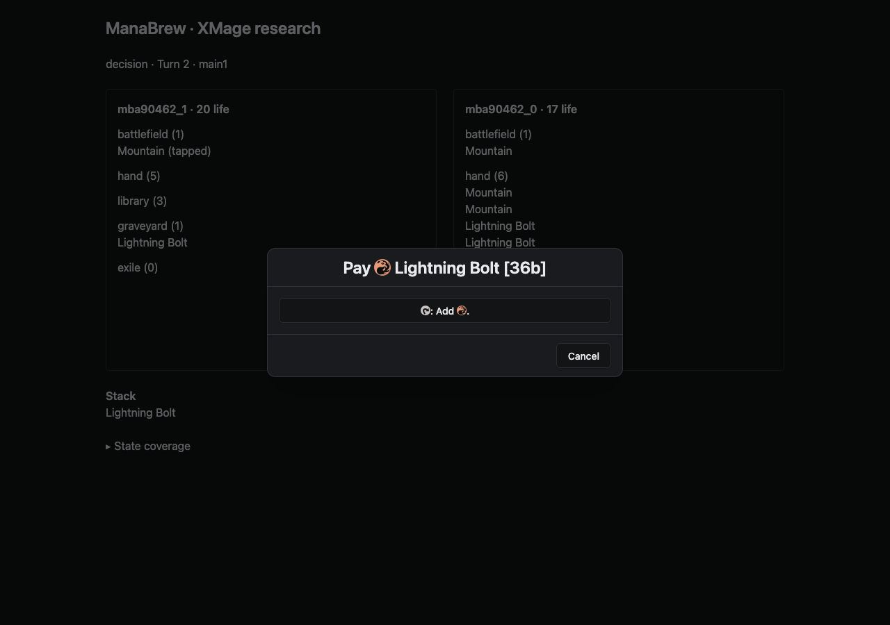

# XMage → ManaBrew research adapter

Research branch: `research/xmage-protocol`. The Java subprocess connects through XMage's JBoss `SessionImpl` and exposes JSON-RPC 2.0 over NDJSON stdin/stdout. XMage remains the rules authority. Decisions and state use the actual ManaBrew protocol, with experimental extensions in this branch; there is no raw native-answer escape hatch.

**Verified:** two headless ManaBot clients can play complete local games on an unmodified XMage release server. Spells, targeting, manual mana payment, attackers, blockers, and damage allocation have live coverage. A separate research browser page now uses ManaBrew’s actual prompt components against a local HTTP bridge, with ManaBot as the opponent. The normal game board, lobby and relay launch flow are not connected. Public-server compatibility and reconnect are unverified.

## Shared-engine checkpoint

**One schema and one Rust protocol-agent binary now drive completed games on both Java Forge and stock XMage.** The engine-specific adapters retain transport and rules decisions; the bot consumes canonical `AgentPrompt` and returns canonical responses. This proves interoperability for the recorded mechanics, not all MTG cards or production readiness.

[Shared-engine results](fixtures/shared-engine-results.json) archive six new completed runs:

| Engine | Scenario | Accepted decisions | Canonical states | Evidence |
| --- | --- | ---: | ---: | --- |
| Forge | Lightning Bolt | 115 | 115 | Casting, targeting, payment and damage |
| Forge | Fireball | 584 | 584 | 19 numeric prompts, nonzero X and damage |
| XMage | City of Brass / Lightning Bolt | 117 | 409 | Unclassified mana actions and color selection |
| XMage | Goblin War Buggy | 114 | 393 | Four payment prompts without an identified source card |
| XMage | Blocking | 136 | 439 | Incremental combat and constrained numeric allocation |
| XMage | Fireball | 406 | 1,285 | Nonzero X, required numeric answers and damage |

The same Rust capture checker deserializes both engines' prompts, states and accepted responses. It also verifies that the shared contract rejects 3,106 malformed or out-of-contract XMage responses; stale-prompt checks remain adapter/session concerns and are counted separately by the smoke. Forge's direct probe sends valid responses only: it bypasses the normal node validation boundary and does not establish Java-side rejection parity.

Numeric choices now advertise `cancellable`; Forge forwards its existing `canCancel`, while XMage numeric dialogs require a number and staged allocations inherit the native cancel option. Missing fields retain the legacy protocol behavior. Numeric bounds and weighted selection constraints are checked by the shared Rust validator, including unknown indices, disallowed repetitions and total overflow. The frontend exposes cancellation only when advertised and no longer truncates fractional numeric input.

Payment source ID/name are optional, and payment actions can be unclassified. A resolving echo cost has no unpaid stack card to identify; it must still be payable. City of Brass demonstrates why a native mana choice must not be dropped just because XMage omits a semantic ability classification. Special payment actions are mapped but have not yet been exercised live. Cancellable multi-amount handling is implemented from the native API; only non-cancellable combat allocation has live coverage here.

The probes remain deliberately simple policies. Fireball uses X=2 within the engine's bounds; the Forge probe also requests one target because zero targets is a legal but uninformative choice. The echo probe confirms the advertised `Yes` choice. No adapter infers rules from these card names. The main app, public servers, reconnect, full Forge AI, capability/version negotiation and complete state fidelity remain outside this checkpoint.

### Reproduce the Forge side

Build the existing harness (`node scripts/harness.mjs build`) and `protocol-agent`, then from the repository root:

```sh
mkdir -p tmp
javac -cp forge-harness/target/forge-harness-jar-with-dependencies.jar \
  -d tmp xmage-adapter/ForgeProbe.java
java -Xmx2048m -Djava.awt.headless=true \
  -cp tmp:forge-harness/target/forge-harness-jar-with-dependencies.jar \
  ForgeProbe forge/forge-gui/ target/debug/protocol-agent tmp/forge.jsonl x-cost
cargo run --locked -q -p manabrew-protocol --example validate_xmage_capture -- tmp/forge.jsonl
```

Omit `x-cost` for Lightning Bolt. Use `;` as the Java classpath separator on Windows. The assets argument is `forge/forge-gui/`, not its `res/` subdirectory. The probe bounds the game at 120 seconds and each bot answer at ten seconds, cleans up sessions/bots, and requires targeting, payment and actual damage. It uses two separate agent processes and captures each deciding seat's view while the engine waits on that prompt.

## Initial recorded results

Official XMage `1.4.61-V1 (build: 2026-08-12 12:28)`, JDK 18, local server, two Human seats controlled by the Rust `protocol-agent` binary using ManaBot's `SimpleAi`. These are protocol probes, not measurements of playing strength.

| Scenario                           | Accepted decisions | Invalid responses rejected | State snapshots | Outcome                                                                             |
| ---------------------------------- | -----------------: | -------------------------: | --------------: | ----------------------------------------------------------------------------------- |
| Mountain / Lightning Bolt          |                102 |                        405 |             361 | Complete game; spells resolved; eventual empty-library loss                         |
| Mountain / Raging Goblin           |                150 |                        597 |             488 | Complete game; 30 incremental attacker prompts; combat damage                       |
| Same creatures, one defensive seat |                136 |                        541 |             439 | Complete game; blocker choices and five bounded numeric damage-allocation decisions |
| Larger Lightning Bolt deck         |                138 |                        549 |             499 | Complete game; opponent reached −1 life                                             |
| Explicit mana-pool spending        |                112 |                        445 |             384 | Complete game; ten explicit pool-color choices with XMage auto-spending disabled    |
| Mountain / Prodigal Pyromancer     |                 57 |                        225 |             224 | Expected stop: unclassified priority ability, an **adapter gap**                    |

This initial audit predates the unclassified-action extension described below; its Pyromancer stop is preserved as historical evidence. Initial total: 695 accepted decisions, 2,762 invalid responses rejected, 2,395 states. The complete captures are compressed under [fixtures](fixtures/); [results.json](fixtures/results.json) records scenario counts, outcomes, findings, and SHA-256 hashes of the uncompressed captures. The older uncompressed Lightning Bolt fixture preserves the original target-intent finding before schema changes.

The current smoke also rejects string and floating-point prompt IDs; [typed-response-results.json](fixtures/typed-response-results.json) records 74 accepted responses and 441 rejected responses with that stricter check. Counts in earlier captures predate it.

The smoke checks stale/duplicate prompts, wrong response families, unadvertised action/object IDs, unavailable auto-pay, and out-of-range amounts. It checks the actual card names received from the server, that opponent hands and libraries remain undisclosed in these scenarios, and that the intended combat/damage behavior occurred. The Rust validator independently deserializes prompts, states and accepted responses, applies protocol validation, checks zone counts/privacy for these scenarios, and rejects duplicate accepted decisions. It does not reimplement MTG legality or certify arbitrary hidden-information effects.

## Expanded coverage

The next four bot runs all completed; [expanded-results.json](fixtures/expanded-results.json) and the `*-expanded.jsonl.gz` captures preserve the evidence.

| Scenario                  | Accepted decisions | Invalid responses rejected | State snapshots | Additional behavior                                                                  |
| ------------------------- | -----------------: | -------------------------: | --------------: | ------------------------------------------------------------------------------------ |
| Prodigal Pyromancer       |                 74 |                        293 |             287 | An unclassified native ability was selected, targeted and resolved for damage        |
| You See a Pair of Goblins |                 73 |                        286 |             279 | Spell-mode selection, payment and resolution; graveyard checked                      |
| Brave the Elements        |                102 |                        395 |             364 | Ten native finite color choices during resolution                                    |
| Fireball, X=2             |                469 |                      1,873 |           1,435 | 28 turns; numeric choices, repeated targets, payment cancellation and nonzero damage |

These four runs add 718 accepted responses and 2,365 states. Modal/color tests require the actual spell to reach the graveyard; merely responding to a dialog is insufficient. The X-cost agent deliberately chooses 2 within each native numeric range, rather than treating the server's `i32::MAX` upper bound as affordable mana.

The browser smoke separately clicks the real React controls in headless Firefox, through the HTTP bridge. It checks completion, target/payment controls, browser runtime errors, native HTML leakage, and rejection of wrong-origin/wrong-family HTTP requests. Its results and capture are recorded separately under [browser-results.json](fixtures/browser-results.json) and `xmage-1.4.61-browser.jsonl.gz`: 112 accepted decisions, 445 invalid responses rejected, 383 state snapshots. The browser clicked 55 prompts across Boolean, priority, target and payment controls with no runtime errors.



## Run locally

Requirements: Python 3, JDK 17+, Rust, and the official [XMage 1.4.61V1 release](https://github.com/magefree/mage/releases/tag/xmage_1.4.61V1). Set `XMAGE_HOME` to the extracted `xmage` directory containing `mage-client` and `mage-server`. Keep runtimes and logs outside tracked source.

In `mage-server/config/config.xml`, set the server element's `serverAddress` to `127.0.0.1` and `port` to `17179`. From `mage-server`:

```sh
java -Xmx1024m -Djava.awt.headless=true \
  --add-opens=java.base/java.io=ALL-UNNAMED \
  --add-opens=java.base/java.lang=ALL-UNNAMED \
  --add-opens=java.base/java.util=ALL-UNNAMED \
  --add-opens=java.base/java.net=ALL-UNNAMED \
  -jar lib/mage-server-1.4.61.jar
```

After the server starts, from the ManaBrew repository root:

```sh
export XMAGE_HOME=/path/to/extracted/xmage
cargo build --locked -p manabot --bin protocol-agent
python3 xmage-adapter/smoke.py --agent target/debug/protocol-agent \
  --scenario blocking --capture tmp/xmage/blocking.jsonl
cargo run --locked -q -p manabrew-protocol --example validate_xmage_capture \
  -- tmp/xmage/blocking.jsonl
```

Scenarios: `bolt`, `combat`, `blocking`, `lethal`, `activated`, `manual-pool`, `modal`, `color`, `x-cost`, `any-mana`, `echo`. All now expect completed games. `--expect-gap CODE` remains available for deliberate boundary probes; the archived activated-ability gap is no longer expected from current code.

Omitting `--agent` uses the Python smoke policy. The defensive seat for `blocking` requires `--agent`; it runs `protocol-agent --hold-attackers`. The `x-cost` policy passes `--number-choice 2`. Most decks have ten cards under `Constructed - Freeform Unlimited`; `lethal` and `x-cost` use larger decks. XMage shuffles are not seeded by this harness, so counts and winners vary. Automated runs time out after 90 seconds; bot decisions after ten seconds. The smoke only connects to loopback and cleans up its table and processes.

Validate a saved capture without Java or a running server:

```sh
set -o pipefail
gzip -dc xmage-adapter/fixtures/xmage-1.4.61-blocking.jsonl.gz | \
  cargo run --locked -q -p manabrew-protocol --example validate_xmage_capture -- -
```

If using another `CARGO_TARGET_DIR`, pass that directory's `debug/protocol-agent` to `--agent`. Build the frontend protocol types with `cargo xtask gen-types`.

## Play through the research browser

Start the local XMage server and build `protocol-agent` as above. Then run these in separate terminals from the repository root:

```sh
node_modules/.bin/vite --host 127.0.0.1 --port 1420
```

```sh
export XMAGE_HOME=/path/to/extracted/xmage
python3 xmage-adapter/smoke.py --scenario manual-pool \
  --agent target/debug/protocol-agent --human-port 18765 \
  --ui-origin http://127.0.0.1:1420 --capture tmp/xmage/browser.jsonl
```

Open **http://127.0.0.1:1420/xmage-research.html**. You control seat 0; ManaBot controls seat 1. This is a research entry page with a simple state display and the existing ManaBrew prompt components, not the normal Pixi game board. It supports the prompt families exercised here. `?port=NNNN` selects another local bridge port.

The HTTP bridge binds to `127.0.0.1`, permits the explicitly configured browser origin, and publishes only seat 0's canonical state and pending prompt. It accepts canonical responses and checks the current prompt ID/family before handing them to the Java adapter. HTTP acceptance means queued, not engine acceptance. The Java adapter remains the action-validation boundary. It never publishes the bot's private hand. Refreshing the page reloads the pending prompt; this is not XMage session reconnect support.

Interactive runs allow 30 minutes overall; XMage's own 15-minute player clock still applies. The smoke's scenario assertions are disabled for a human's strategy, but protocol rejection checks and private-zone/card-printing checks remain active. The bridge closes after the game or an interruption. The research HTML is a separate Vite development entry; it is not added to the production app router or engine selector.

To exercise the browser automatically while the interactive run is waiting:

```sh
node xmage-adapter/browser-smoke.mjs
```

This uses the project's Playwright dependency and an installed Firefox binary. It expects the default ports/origin above and the manual-pool scenario. Capture the game afresh for each run. Browser screenshots/results go to `tmp/`.

## RPC boundary

Start `xmage-adapter/run` for one session. It compiles against the release client jars; `--build-only` and `--no-build` are available. Protocol output uses stdout; diagnostics use stderr.

| Method        | Parameters                                                                                |
| ------------- | ----------------------------------------------------------------------------------------- |
| `connect`     | `host`, `port`, `username`, optional `password`, optional `autoSpendMana` (defaults true) |
| `createTable` | Optional `deckType`; creates a two-human, best-of-one duel                                |
| `joinTable`   | `tableId`, XMage `DeckCardLists` JSON (`cards`, `sideboard`, `name`)                      |
| `startMatch`  | `tableId`                                                                                 |
| `joinGame`    | `gameId`, received in `gameStarted`                                                       |
| `respond`     | Canonical ManaBrew `ClientToServerMessage::Response`                                      |
| `concede`     | `gameId`                                                                                  |
| `removeTable` | `tableId`                                                                                 |

Notifications: `connected`, `disconnected`, `gameStarted`, `state`, `prompt`, `gameEnded`, `callback`, `compatibilityFinding`, `adapterError`, `message`, `serverError`.

```json
{"jsonrpc":"2.0","id":1,"method":"connect","params":{"host":"127.0.0.1","port":17179,"username":"mbprobe"}}
{"jsonrpc":"2.0","id":2,"method":"respond","params":{"kind":"response","promptId":1,"action":{"type":"chooseBoolean","output":{"type":"decision","value":false}}}}
```

`prompt.params` is an `AgentPrompt`; `state.params` is a `StateUpdate`. Prompt IDs are monotonic within the process, and superseded decisions become stale. A successful response means the adapter accepted it and submitted the native answer (or advanced a staged numeric allocation); XMage can still reject an incomplete declaration and ask again. A new prompt supersedes the previous one. `callback` is diagnostic evidence, not gameplay protocol. The Rust subprocess agent consumes one `AgentPrompt` per line and produces one canonical response per line; this baseline currently ignores state snapshots.

The adapter intentionally uses a local subprocess boundary, not an exposed network service. It does not implement general JSON-RPC batching, notification requests, retry deduplication, or session restoration.

## Protocol findings and experimental changes

1. **Target intent cannot be required engine knowledge.** Stock XMage sends target UUIDs, presentation text and query metadata, but not a semantic label such as Damage or Heal. `TargetingIntent::Unknown` avoids guessing from card names or text. The UI gives it no semantic glyph.
2. **Incremental object selection differs from aggregate assignment.** `ChooseObject` carries candidate `TargetRef`s, the selected subset, intent, and advertised Finish/Cancel operations. A Select sends one native object choice; selecting an already-selected object may toggle it according to that engine interaction. This represents targeting and attacker/blocker declaration without fabricating aggregate constraints. Candidates are offered interactions, not a guarantee of a complete legal final assignment; XMage validates completion. Native target `min=0,max=0` are not copied as aggregate bounds.
3. **Auto-pay is a capability.** `PayManaCost.autoPayAvailable` defaults to true for existing producers; XMage advertises false. `SpendMana` represents explicit pool-color choices alongside mana abilities. The protocol rejects unavailable payment operations. Manual payment gets its own UI controls. The source card is optional when the native callback cannot identify it.
4. **Pregame is a real state.** `StepKind::Pregame` represents native snapshots without a turn step. Converting it to a Forge phase returns no phase instead of inventing Untap.
5. **Incomplete state must be visible.** Optional `StateUpdate.unavailableFields` reports unsupported projection paths. Existing producers omit it. This is research metadata, not negotiated capability/version support, and existing stores do not yet enforce it.
6. **Unclassified actions must remain actionable without fabricated semantics.** `AvailableActionKind::Unclassified` carries an opaque ID, card ID and native label. It covers XMage’s mixed `other` bucket without calling every entry an ordinary activated ability. ManaBot can mechanically choose it, and the UI exposes a generic action picker. This preserves interaction, not strategic understanding of the action.
7. **Some native compound decisions need no schema change.** `GAME_GET_MULTI_AMOUNT` is staged through existing `ChooseNumber` prompts. At each step, bounds preserve a feasible total for the remaining entries. Only the completed vector is submitted. This loses the native dialog's ability to revise earlier entries before submission; cancellable allocations advertise cancellation on each stage and submit the native cancel response without sending a partial vector.

These additions are experimental and are **not safe to deploy to older consumers without version/capability negotiation**. No public protocol version or release has been changed.

## State fidelity and boundaries

Snapshots project turn/step, players/life/mana, own hand, public battlefield/graveyard/exile, library and opposing-hand counts, stack, and basic combat assignments. Battlefield buckets use actual controller identity, rather than XMage's attachment-oriented view grouping. Hidden native cards remain hidden. Native HTML is converted to plain presentation text at the Java boundary, preserving mana-symbol notation. A live browser check caught and verified the fix for raw HTML in payment titles. Raw callback evidence retains the original markup.

`unavailableFields` is a conservative list of dot paths; `*` covers every element. `gameView.zones.command` denotes the omitted command zone. It covers unimplemented keywords, specialized card statuses/costs, commander/progression fields, stack ownership, and other omissions. Defaults at those paths are placeholders, not assertions that the game mechanic is absent. Some cards may supply a field that is conservatively masked for the whole projection. Non-permanent controller attribution follows zone ownership; temporary control of another player's turn and revealed opponent hands are not modeled. Native reveal/look-at notifications are not yet projected. Terminal snapshots may omit a winner when the native result only identifies the local player's loss; the result notification retains the native outcome text.

Other known limits:

- The `other` bucket is now exposed as Unclassified. Exact casting/activation semantics and non-basic mana-ability classification remain unavailable; a playable option is not a semantic model for stronger bots.
- Special priority actions, alternative costs, pile/card ordering and other unimplemented callbacks stop with an `adapterGap`. Finite required/optional `GAME_CHOOSE_CHOICE` maps to selection; custom text choices still stop. Modal/number/ability mappings beyond the recorded paths need broader live coverage.
- Arbitrary combat restrictions, deathtouch/trample ordering, multiplayer, Commander, sideboarding, drafts and tournaments are not established by these games.
- Pass-until/exhaust-stack and snapshot restore are unsupported; the subprocess ManaBot uses single priority passes.
- No app/relay/node launch path, authentication UX, replay-resume, or public-server session has been integrated. The standalone browser exercises prompt controls end to end, but the normal game board has not been exercised against XMage.

## Native picker identity

Ability selection and spell modes share `GAME_CHOOSE_ABILITY`. The adapter only auto-selects the previously requested ability if its ID is actually among the new choices; otherwise it exposes a new selection. It preserves native choice order. Sorting UUIDs had put the synthetic Cancel entry before the actual modes, producing answered dialogs without a cast spell. The modal scenario now asserts payment/resolution evidence as well as choice handling.

## XMage client callback workaround

Local runs intermittently lost START_GAME and priority callbacks. In this release, `SessionImpl.CallbackHandler` adds to a shared list outside the monitor used to copy and clear it; an arrival between the copy and clear can disappear. [SerializedSession](src/mage/remote/SerializedSession.java) installs a synchronized handler subclass before connecting, using a reflected private field. It preserves the stock JBoss transport and server protocol. Subsequent scenario runs completed without dropped-callback timeouts, but this is not a proof against every transport failure.

This workaround and the serialized playable-ability category inspection are deliberately version-specific. Re-audit against another XMage release; neither is a stable public client API. Update callbacks also follow the stock GUI's outdated-message filtering convention.

## Spellbench and Forge

[Spellbench](https://github.com/jackmaiorino/spellbench/) is useful precedent for conformance captures, bounded subprocess decisions, candidate identity, and distinguishing engine halts from game losses. Its [v2 draft](https://github.com/jackmaiorino/spellbench/blob/main/spec/SPELLBENCH_PROTOCOL_V2.md) describes an XMage integration through **CABT, an XMage overlay**. That is a different boundary from a stock public-server client. In particular, the draft's promise that every candidate extends to a legal complete answer is stronger than what the stock incremental combat callback establishes. We should not claim that guarantee here.

Running Forge's full AI is a separate project: its [AiController](https://github.com/Card-Forge/forge/blob/192b5eab000069bbb8917a5df9d60d4a9128aa07/forge-ai/src/main/java/forge/ai/AiController.java) owns Forge `Player`, `Game`, combat prediction and spell-ability simulation objects. Reconstructing those from an incomplete client view risks introducing a second, divergent rules authority. A smaller next experiment would port selected scoring heuristics over canonical visible state and rank only XMage-offered choices. That would be a Forge-inspired ManaBot policy, not the full Forge AI. No Forge AI or Spellbench interoperability is claimed by this branch.

## Validation performed

- Initial six-scenario audit, four expanded completed-game scenarios, independent Rust capture validation, and a live Firefox prompt-UI game against ManaBot. The original activated-ability stop remains an archived historical fixture.
- `cargo check --locked -p manabot -p self-hosted-node`.
- `cargo clippy --locked -p manabot -p manabrew-protocol --all-targets -- -D warnings`.
- Forge harness rebuild and its three regression entrypoints; existing protocol tests, generated TypeScript types, frontend typecheck, and ESLint on changed frontend files.
- Java compiled against the released client jars on every smoke run.

The research worktree uses existing ignored WASM build artifacts for the frontend typecheck. No public server or deployment is involved. Research is tracked in [draft PR #1017](https://github.com/witchesofthehill/manabrew/pull/1017).

References: [XMage session](https://github.com/magefree/mage/blob/xmage_1.4.61V1/Mage.Common/src/main/java/mage/remote/SessionImpl.java), [human interaction](https://github.com/magefree/mage/blob/xmage_1.4.61V1/Mage.Server.Plugins/Mage.Player.Human/src/mage/player/human/HumanPlayer.java), [ManaBrew prompt definitions](../manabrew-rs/crates/manabrew-protocol/src/prompts/).
